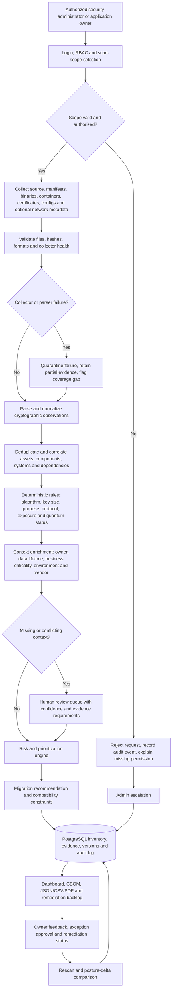

# SIH26164 — Enterprise Cryptographic Discovery & Analysis Tool (ECDAT)
## Research, feasibility, innovation, and SIH execution report

**Prepared for:** SIH 2026 team
**Problem statement:** SIH26164
**Working title:** Enterprise Cryptographic Discovery & Analysis Tool (ECDAT)
**Report status:** Decision-ready research brief based on the uploaded master prompt and available public/official sources

> **Bottom line:** ECDAT is a strong SIH problem because the first step of post-quantum migration is not replacing algorithms; it is discovering where cryptography exists, what it protects, how long it must remain protected, and which systems should be migrated first. The winning version should therefore be an **evidence-backed CBOM and prioritization platform**, not a generic dashboard or an unvalidated “AI quantum scanner.”

## 1. What the uploaded PDF is asking for

The uploaded PDF is a **master research and PS-selection framework**, not the full SIH26164 statement by itself. It asks the team to investigate a problem across source verification, real-world workflow, existing solutions, competition, research gaps, data, feasibility, architecture, failure modes, validation, demo design, hostile judging, deployment, and future potential.

For a single shortlisted PS, the framework is useful as an execution checklist. It is too broad to treat every requested technology as a requirement. The report therefore applies its decision tests selectively:

- **Hard gate:** Can the team obtain or create usable data and demonstrate a measurable result?
- **Novelty test:** Is the differentiator a capability rather than login, dashboard, search, or chatbot?
- **WOW test:** Can the advanced technology be shown against a baseline?
- **Pivot test:** Can the project remain strong if a scanner, model, API, or dataset fails?
- **Judge test:** Can the team explain the system’s evidence, limitations, and deployment path under hostile questioning?

The PDF explicitly requires uncertainty to be labelled as **Unknown, Not available, or Assumption**. This report follows that rule.

## 2. Problem statement verification

### Confirmed identity

| Field | Verified finding |
|---|---|
| PS ID | **SIH26164** |
| Title | **Enterprise Cryptographic Discovery & Analysis Tool (ECDAT)** |
| Organization | **National Technical Research Organisation (NTRO)** |
| Category | **Software** |
| Theme | **Blockchain & Cybersecurity** |
| Core domain | Cryptographic asset discovery, quantum-risk assessment, CBOM analytics, migration prioritization |

The official SIH 2026 portal is available at the problem-statement listing URL, but its returned page is dynamically rendered and did not expose the SIH26164 record in the raw response during verification. The detailed wording used in this report is cross-checked against a public transcription that links back to the official SIH portal. Treat the organization, category, theme, title, and requirements above as high-confidence; treat any unverified administrative metadata such as idea counts or deadlines as **time-sensitive and not material to the technical recommendation**. [1]

### Reconstructed requirements from the public statement

ECDAT is expected to:

1. Identify and catalogue cryptographic artefacts across internal and externally facing applications, products, and infrastructure.
2. Cover artefacts such as algorithms, keys, certificates, protocols, libraries, hardware modules, and cloud services.
3. Perform quantum-risk assessment and identify systems exposed to potential quantum attacks or protecting sensitive data.
4. Classify artefacts by type, lifetime, and business criticality.
5. Apply a structured risk method such as **Mosca’s inequality**, comparing the time required to migrate with the time sensitive data must remain protected and the expected arrival of a cryptographically relevant quantum computer.
6. Recommend PQC or hybrid alternatives based on risk, latency, cost, and operational constraints.
7. Produce a standardized report or CBOM-style inventory.
8. Provide an interactive GUI for scan visualization, risk analysis, and results.

The statement should not be interpreted as requiring perfect discovery of every cryptographic operation in every enterprise environment. Current government guidance explicitly recognizes that automated tools have blind spots, especially for embedded algorithms, customized applications, and vendor-controlled packages. [2]

## 3. Why this problem matters now

NIST finalized its first three post-quantum standards in August 2024: **FIPS 203 / ML-KEM** for key establishment, **FIPS 204 / ML-DSA** for digital signatures, and **FIPS 205 / SLH-DSA** as a hash-based signature standard. NIST encouraged system administrators to begin transition work rather than wait for future standards. [3]

The practical challenge is inventory. An organization cannot prioritize migration if it does not know:

- which algorithms and protocols are in use;
- where public-key cryptography is used;
- which certificates, keys, libraries, devices, services, and applications depend on it;
- which data has a long confidentiality lifetime;
- which systems are business-critical;
- which dependencies are difficult to replace;
- whether a migration will affect latency, interoperability, hardware, or compliance.

NIST describes its cryptographic discovery workstream as using inventory tools to learn where and how cryptography protects important data and systems, then using that inventory to support risk management and migration prioritization. [4] CISA similarly describes automated discovery across network, file-system, database, and software-package surfaces, while noting that several contextual fields still require manual collection. [2]

This gives ECDAT a defensible framing:

> **ECDAT is an evidence-collection and migration-decision system for cryptographic risk, not a crystal ball that predicts the date of a quantum computer.**

## 4. The real problem behind the statement

### The real problem

Security and infrastructure teams lack a trustworthy, continuously refreshable map of cryptography across heterogeneous enterprise assets. Cryptography is distributed across application source code, binaries, dependencies, configuration, certificates, TLS endpoints, databases, operating systems, containers, hardware security modules, cloud services, and vendor products.

### The problem behind the problem

Discovery alone is not enough. A list of “RSA-2048 found in file X” does not tell an owner whether the finding is exploitable, whether the key is used for encryption or signatures, what data is protected, whether the system is internet-facing, how long the data must remain confidential, what replacement is compatible, or what migration should happen first.

The hard problem is the **joining of technical evidence with business and temporal context**.

### Most important unresolved bottleneck

The most important bottleneck is **context completeness and confidence**:

- automated scanners can find patterns but may miss runtime, embedded, proprietary, or hardware cryptography;
- asset owners may not be known;
- data lifetime and business criticality are rarely present in code;
- algorithm detection may produce false positives or ambiguous findings;
- vendor packages may expose no source or cryptographic metadata;
- an enterprise may have several copies of the same cryptographic dependency.

ECDAT should make these limitations visible instead of hiding them behind a single risk score.

## 5. Current-state workflow and failure points

### Text workflow

**Security administrator / application owner enters system**
→ authenticates and selects repository, artifact, endpoint, package, or uploaded sample
→ ECDAT validates scope and authorization
→ collectors scan source, dependency manifests, binaries, containers, certificates, configurations, and optional network metadata
→ parsers normalize findings into a common cryptographic asset model
→ deduplication correlates assets with components, systems, owners, data classes, and dependencies
→ deterministic rules classify algorithm, key size, protocol, purpose, exposure, and quantum vulnerability
→ owner or administrator enriches missing fields such as data lifetime and business criticality
→ risk engine calculates priority and confidence using evidence plus context
→ recommendation engine maps findings to migration options such as ML-KEM, ML-DSA, SLH-DSA, or hybrid deployment, without claiming automatic production readiness
→ PostgreSQL stores immutable findings, evidence references, versions, and audit events
→ CBOM/JSON/CSV/PDF reports and dashboard are generated
→ administrator reviews exceptions and assigns remediation
→ owner feedback corrects false positives or missing context
→ rescans compare posture over time and update the migration backlog.

### Mermaid flowchart



### Workflow failure points and ECDAT responses

| Failure point | Why it matters | ECDAT response |
|---|---|---|
| Unauthorized scan | Scanning sensitive systems can itself create risk | Explicit scope approval, RBAC, audit log, read-only collectors |
| Unsupported artifact | Blind spot can be mistaken for “no risk” | Coverage report and “not assessed” state |
| Regex false positive | Weakens trust in the inventory | Evidence snippet, parser confidence, suppression with justification |
| Embedded or proprietary crypto | May not be visible in source or package metadata | Binary signatures, vendor metadata import, manual evidence workflow |
| Duplicate observations | Inflates risk and remediation effort | Stable asset identity and provenance-aware deduplication |
| Missing owner or data lifetime | Prevents meaningful prioritization | Human enrichment queue with explicit unknown values |
| Stale scan | Inventory becomes misleading | Scan timestamp, freshness score, scheduled rescans |
| Wrong PQC recommendation | Could break interoperability or security | Recommendation as decision support, not auto-remediation; compatibility checks |
| Collector failure | Creates silent gaps | Health monitoring and partial-scan coverage warnings |
| AI hallucination | Security decisions become unsafe | No LLM in core classification; evidence-constrained explanations only |

## 6. Existing solution landscape and competitive interpretation

### Standards and public guidance

**NIST NCCoE migration project.** NIST separates cryptographic discovery/inventory from PQC interoperability testing. Its discovery workstream exists specifically to understand cryptography usage and support prioritization. This validates the problem architecture. [4]

**CISA automated discovery strategy.** CISA describes discovery across network, file system, database system, and software-package surfaces. It also states that important fields such as system identifiers, hosting context, data lifecycle, and some custom or embedded cryptography may remain manual. This is the strongest evidence for ECDAT’s human-in-the-loop and coverage-confidence design. [2]

**CycloneDX CBOM.** CycloneDX provides a standard representation of cryptographic assets, including algorithms, keys, certificates, and their relationships to software components. ECDAT should export to a compatible CBOM-like format rather than inventing an isolated schema. [5]

### Commercial benchmark

**Keyfactor AgileSec** markets sensors for code, servers, endpoints, cloud workloads, and network traffic; inventory of algorithms, certificates, SSH keys, tokens, protocols, and libraries; prioritization; continuous monitoring; and integration with ITSM, GRC, CMDB, and certificate-management workflows. [6]

This proves that “scan plus dashboard” is not novel by itself. ECDAT must differentiate through one or more of the following:

- transparent, reproducible evidence and confidence;
- offline or self-hosted operation suitable for sensitive environments;
- a lightweight student-accessible collector and reproducible benchmark corpus;
- stronger treatment of custom/embedded artifacts and coverage gaps;
- Indian public-sector deployment assumptions and data governance;
- explainable prioritization based on Mosca-style timing, data lifetime, business criticality, exposure, and migration effort;
- export interoperability with CBOM and existing security workflows.

### Open-source benchmark

The QRAMM ecosystem includes open-source projects such as **CryptoScan** and **CryptoDeps** for identifying cryptographic algorithms and cryptographic dependencies in codebases. These are valuable baselines and possible integration references, but a code-only scanner is narrower than the SIH requirement. [7]

### What a normal SIH team will probably build

A normal team is likely to build:

1. a web upload form;
2. regex-based source-code scanning;
3. a list of algorithms and certificates;
4. a severity-colored dashboard;
5. a basic “quantum-safe / not quantum-safe” label;
6. an LLM-generated report.

That may satisfy a superficial demo but will be vulnerable to the question: **“What is technically new, and how do you know your result is correct?”**

## 7. Recommended innovation position

### One-sentence innovation compression

> **ECDAT converts heterogeneous cryptographic evidence into a confidence-scored CBOM and an explainable migration backlog that shows which systems should move first, why, and what evidence is still missing.**

### Capability features, not generic features

| Capability | User value | Evidence and validation | SIH demo value |
|---|---|---|---|
| Multi-surface discovery | Finds crypto in source, dependency manifests, binaries, containers, certificates, and configs | Seeded benchmark with known ground truth | Upload one repository and reveal multiple asset classes |
| Evidence-linked findings | Every result shows file, line, hash, parser, timestamp, and confidence | Precision/recall and manual review | Judge clicks a risk and sees why it exists |
| Crypto dependency graph | Shows which application, library, certificate, protocol, and data class are connected | Graph consistency and deduplication tests | Change one component and see affected systems |
| Mosca-style priority engine | Turns inventory into migration order | Synthetic scenarios with controlled lifetimes and deadlines | Judge changes data lifetime and observes reprioritization |
| Coverage and uncertainty map | Separates “safe,” “not found,” and “not assessed” | Inject unsupported formats and collector failures | Honest explanation of blind spots |
| Migration decision support | Suggests candidate PQC/hybrid paths with constraints | Rule-based compatibility tests | Compare ML-KEM/ML-DSA/hybrid alternatives |
| CBOM export and posture diff | Makes output reusable and auditable | Schema validation and rescan delta tests | Before/after migration report |
| Human feedback loop | Improves findings without opaque model retraining | False-positive correction and audit replay | Reviewer approves or rejects a finding live |

### Strongest differentiator

The strongest practical differentiator is **uncertainty-aware prioritization**:

- **Confirmed vulnerable:** strong evidence of a deprecated or quantum-vulnerable algorithm with known context.
- **Likely vulnerable:** evidence is strong but one contextual field is missing.
- **Unknown coverage:** the collector could not inspect the artifact or runtime.
- **Not a finding:** an observed algorithm is not automatically a vulnerability; purpose and context matter.

This is more defensible than claiming complete discovery.

## 8. Research gap and technical bottleneck

### Existing approach → limitation → gap → proposed contribution

**Pattern matching and package metadata** → often misses runtime, embedded, proprietary, hardware, or custom cryptography → incomplete enterprise coverage → combine multiple evidence sources and expose coverage confidence.

**Flat inventory** → does not model relationships or downstream impact → poor prioritization → construct an evidence graph linking assets, components, systems, data classes, protocols, owners, and migration candidates.

**Binary quantum-vulnerability labels** → ignore data lifetime, business criticality, exposure, and migration time → noisy remediation order → implement a transparent temporal and business-context risk model.

**LLM-generated security explanations** → can hallucinate unsupported claims → unsafe recommendations → constrain natural-language explanations to retrieved evidence and deterministic rules.

**Vendor-specific platforms** → expensive, complex, or difficult to reproduce in an academic setting → limited student validation → create a reproducible benchmark pack and open report format.

### Research question

> Can a provenance-aware, multi-surface cryptographic inventory improve the precision and actionability of PQC migration prioritization compared with a flat algorithm list, under incomplete and conflicting enterprise metadata?

### Testable hypothesis

A provenance-aware graph plus deterministic contextual prioritization will reduce false prioritization and improve reviewer agreement over an algorithm-only baseline, especially when data lifetime, business criticality, and asset exposure are incomplete.

### Research gap classification

- **Established:** the need for cryptographic inventory and PQC migration is established by NIST and CISA.
- **Likely:** CBOM-style representation and multi-source correlation are valuable.
- **Underexplored for a student project:** measurable uncertainty and coverage reporting for incomplete enterprise discovery.
- **Uncertain:** a genuinely new detection algorithm for all binary, runtime, hardware, and proprietary cryptography. Do not claim this without experiments.

## 9. Data audit

### Required data

ECDAT does not need a giant public training dataset for its core MVP. It needs **controlled evidence corpora**:

- source repositories containing known cryptographic API calls and configuration;
- dependency manifests and lock files;
- binaries and shared libraries with known algorithms or linked crypto libraries;
- container images with known packages and configurations;
- X.509 certificates and TLS configuration samples;
- sample network metadata or pre-captured handshakes, used legally and offline;
- asset metadata: owner, system, environment, data lifetime, business criticality, exposure, and migration effort;
- ground-truth labels for known findings and injected blind spots.

### Data availability assessment

| Dimension | Score /10 | Assessment |
|---|---:|---|
| Availability | 8 | Synthetic and open-source artifacts can support an MVP; real NTRO data is not expected to be public |
| Quality | 6 | Ground truth is achievable for seeded corpora; real-world labels are difficult |
| Uniqueness | 4 | Public code and certificates are not unique; a carefully designed benchmark can add value |
| Data moat | 6 | A labeled multi-surface corpus plus false-positive history can become a moat |
| Data risk | 7 | Sensitive enterprise evidence, secrets, and proprietary code create high risk; higher is safer in this row |

### Hard data risks

- Do not upload real secret keys or production private material.
- Store hashes and metadata rather than secrets wherever possible.
- Treat certificates and public keys as potentially sensitive metadata.
- Use isolated, permissioned sample repositories.
- Keep a strict distinction between “not detected” and “not assessed.”
- Ensure every report has scan time and collector version.
- Use synthetic data to demonstrate long-lived sensitive data and migration urgency.

### Data moat strategy

Build a **reproducible ECDAT Benchmark Pack** containing:

1. seeded source repositories across at least five languages;
2. vulnerable, modern, and ambiguous cryptographic examples;
3. binaries and containers with known provenance;
4. certificate and configuration fixtures;
5. intentionally unsupported samples;
6. ground-truth labels and expected CBOM entries;
7. scenario metadata for data lifetime, criticality, exposure, and migration effort.

This is more valuable than claiming to possess secret government data.

## 10. Technical architecture

### Recommended architecture

Use a modular monolith for the prototype, not microservices. Separate the collectors and asynchronous scan worker from the API, but keep the rest operationally simple.

```text
[React/Next.js UI]
        |
[FastAPI API + RBAC + audit middleware]
        |
[Scan job queue] ---- [Collectors: source | deps | binary | container | cert/config]
        |
[Normalizer + provenance store]
        |
[Rules engine + graph correlation + risk prioritization]
        |
[PostgreSQL + JSONB + object storage for reports/evidence]
        |
[CBOM/JSON/CSV/PDF export + dashboard + remediation backlog]
```

### Practical stack

- **Frontend:** React with a component library and a graph visualization library.
- **Backend:** Python FastAPI; Python fits parsers, security tooling, and reproducible experiments.
- **Workers:** Celery/RQ or a simple managed background worker; avoid Kubernetes for the SIH prototype.
- **Database:** PostgreSQL with JSONB for normalized observations, relational tables for assets and findings, and indexed timestamps, algorithm names, component IDs, and risk status.
- **Object storage:** local filesystem or S3-compatible storage for sanitized evidence and reports.
- **Search:** PostgreSQL full-text search first; add a vector database only if a demonstrated use case appears.
- **Graph:** Start with relational edges. Add Neo4j only if the visual dependency graph cannot be implemented cleanly in PostgreSQL.
- **Auth:** JWT plus RBAC for prototype; roles: administrator, analyst, application owner, auditor.
- **AI:** Optional small local model only for evidence-constrained summarization. Do not use an LLM for algorithm classification, severity, or final migration decisions.
- **Deployment:** Docker Compose for demo; one-command local deployment and an offline mode are stronger than a fragile cloud architecture.
- **Observability:** structured logs, scan IDs, collector versions, audit events, error counts, and coverage metrics.

### Why not over-engineer

Avoid Kubernetes, multi-cloud, autonomous remediation, large model fine-tuning, broad real-time packet interception, and claims of full hardware discovery. These add failure modes without strengthening the SIH proof.

## 11. Risk engine design

The risk engine should be deterministic, inspectable, and versioned.

### Suggested factors

- Algorithm and key-size status.
- Cryptographic purpose: key establishment, encryption, signature, hashing, authentication, or other.
- Exposure: internet-facing, internal, isolated, or unknown.
- Data confidentiality lifetime.
- Business criticality.
- Asset reach and dependency count.
- Migration effort and replacement availability.
- Evidence confidence.
- Scan freshness.
- Regulatory or policy requirement.

### Example transparent score

```text
Priority = 0.25 CryptoRisk
         + 0.20 DataLifetimeRisk
         + 0.15 BusinessCriticality
         + 0.10 Exposure
         + 0.10 DependencyBlastRadius
         + 0.10 MigrationUrgency
         + 0.10 EvidenceConfidence
```

This formula is only an initial design. Validate the weights with scenario tests and allow the administrator to inspect how each factor contributes. Do not present the score as an objective truth.

### Mosca-style timing model

Use a scenario model rather than a prediction:

```text
If data_lifetime + migration_time > estimated_quantum_threat_horizon,
then prioritize migration planning.
```

The threat horizon must be a configurable assumption. ECDAT should show the assumption and run sensitivity analysis rather than hard-code a year as fact.

## 12. 72-hour go/no-go experiment

### First 24 hours: data and baseline

- Create six small repositories with known cryptographic APIs, certificates, weak algorithms, modern algorithms, and ambiguous names.
- Include at least two languages and one dependency manifest.
- Define ground-truth findings.
- Build a baseline scanner using AST/regex plus package metadata.

**Pass:** at least 80% precision and 80% recall on the seeded source corpus, with every finding linked to evidence.

**Warning:** one language or artifact type works, but confidence or evidence is incomplete.

**Fail:** the team cannot produce reproducible findings with known ground truth.

### Hours 25–48: context and prioritization

- Add certificates, a container fixture, and one binary fixture.
- Implement asset identity, provenance, deduplication, data lifetime, criticality, exposure, and Mosca-style scenario fields.
- Produce a priority ranking for 10–20 known findings.

**Pass:** changing data lifetime or criticality predictably changes ranking, and the score explanation is inspectable.

**Warning:** ranking works only with complete metadata.

**Fail:** ranking is opaque or cannot distinguish a low-risk algorithm use from a high-impact system.

### Hours 49–72: demo and validation

- Add dashboard, CBOM-like export, coverage report, and rescan diff.
- Run missing-data and unsupported-format tests.
- Record before/after screenshots and metrics.

**Pass:** a judge can upload an artifact, inspect evidence, change a business assumption, and receive a new explainable priority.

**Warning:** scan works but one collector is unreliable; make it optional and label coverage.

**Fail:** the project requires live production integrations or unavailable ministry data to demonstrate value.

**Pivot if failed:** ship a high-quality source/dependency/certificate inventory with explicit coverage accounting and a strong migration-priority engine. Do not pretend it is an enterprise-wide autonomous scanner.

## 13. Validation moat

### Baselines

1. Regex-only source scanner.
2. Regex plus AST and dependency metadata.
3. ECDAT multi-surface correlation plus provenance and context.

### Required metrics

- Precision, recall, F1 by artifact type.
- False-positive rate for common non-cryptographic uses of words such as “key” or “secure.”
- Duplicate reduction after correlation.
- Coverage rate across supported artifact classes.
- Confidence calibration or at least agreement between confidence bands and manual review.
- Time-to-inventory for a fixed corpus.
- Reviewer agreement on priority ordering.
- Change-detection accuracy across rescans.

### Stress tests

- Missing owner and data-lifetime fields.
- Obfuscated or minified source.
- Multiple versions of the same library.
- Deprecated and modern algorithms in the same repository.
- Duplicate certificates.
- Unsupported binary format.
- Collector timeout and partial results.
- Stale scan compared with a current scan.
- Conflicting metadata from two collectors.

### Ablation study

Remove one component at a time:

- no context;
- no dependency graph;
- no confidence;
- no deduplication;
- no business-criticality factor.

The project becomes research-grade when the team can show which component improves which metric.

## 14. Demo design

### 30-second moment

Upload a repository and show that ECDAT discovers an old public-key algorithm, a certificate, a dependency, and a configuration finding. Click one result to reveal the exact evidence line and confidence.

### 60-second moment

Assign the application a long data-retention period and high business criticality. The finding moves to the top of the migration queue. Reduce the retention period or mark the system isolated; the ranking changes and the explanation states why.

### 5-minute story

1. Scan a deliberately mixed repository and container.
2. Show findings grouped by asset type and cryptographic purpose.
3. Open the dependency graph and trace impact to a business system.
4. Demonstrate a false positive review and audit trail.
5. Show a blind spot as “not assessed,” not “safe.”
6. Export CBOM-like JSON and a management report.
7. Compare baseline flat severity with ECDAT contextual prioritization.
8. Show a migration candidate and its latency/compatibility caveats.

The memorable moment should be the **assumption slider**: the judge changes data lifetime or migration time and sees the migration order update with an explanation.

## 15. Failure analysis and fallback plan

| Failure mode | Probability | Impact | Mitigation / fallback |
|---|---|---|---|
| Official NTRO data unavailable | High | High | Use sanitized synthetic benchmark and clearly label it |
| Source-only scanner misses runtime crypto | High | High | Report coverage; add binary/config/cert collectors |
| Binary analysis too hard | High | Medium | Keep binary collector experimental; preserve source/dependency MVP |
| False positives | Medium | High | Evidence snippets, confidence, reviewer feedback |
| False negatives | High | High | Unsupported/not-assessed state and coverage tests |
| LLM hallucination | Medium | High | Keep LLM out of core decisions; evidence-constrained summaries |
| Incorrect PQC recommendation | Medium | High | Rules and compatibility caveats; no auto-remediation |
| Mosca assumptions challenged | Medium | Medium | Make horizon, lifetime, and migration time configurable |
| Duplicate assets inflate counts | Medium | Medium | Stable IDs, hashes, provenance-aware deduplication |
| Dependency parsing failure | Medium | Medium | Support a limited documented set and record parser errors |
| Certificate parsing failure | Low | Medium | Use established libraries and fixture tests |
| Sensitive sample leakage | Medium | High | Synthetic data, secret redaction, local/offline mode |
| Dashboard failure during demo | Medium | High | Precompute a deterministic demo corpus and provide CLI export |
| Collector timeout | Medium | Medium | Async jobs, timeouts, retries, partial results |
| Team overbuilds cloud architecture | Medium | High | Modular monolith and Docker Compose freeze |
| Existing vendors make novelty weak | High | High | Differentiate on transparency, benchmark, offline operation, and context-aware evidence |
| Team cannot validate at scale | Medium | Medium | Define a reproducible corpus and report scale honestly |
| New PQC standard changes | Low | Medium | Version standards/rules and support configurable mappings |
| Judge asks for full hardware discovery | Medium | High | Explain staged coverage and planned connectors; do not overclaim |
| One flagship model fails | Low | Low | Core system remains deterministic and model-independent |

### Primary → backup → emergency MVP

- **Primary:** multi-surface discovery + provenance graph + contextual risk prioritization + CBOM export.
- **Backup:** source/dependency/certificate/config discovery + evidence-linked scoring + coverage map.
- **Emergency MVP:** reproducible source scanner + Mosca-style scenario calculator + auditable report.

## 16. Hostile judge questions and strong answers

1. **What exactly is novel?**  Not the existence of a scanner. The proposed contribution is evidence-linked, confidence-aware prioritization that joins technical findings with data lifetime, criticality, exposure, and migration effort.
2. **Why does this need AI?**  The core does not require AI. Deterministic analysis is safer. AI is optional for evidence-grounded summarization and analyst assistance.
3. **Does this already exist?**  Commercial platforms exist. ECDAT is not claiming market-wide novelty; it targets transparent, reproducible, offline-capable analysis and a validated benchmark suitable for public-sector and academic deployment.
4. **Where does your data come from?**  Sanitized open-source artifacts, generated fixtures, and synthetic enterprise metadata. Production data would require authorized deployment.
5. **How do you know the scanner is correct?**  Ground-truth fixtures, precision/recall, evidence links, parser tests, and ablation results.
6. **What happens when data is missing?**  The system records unknown, lowers confidence, and routes the finding for review; it never silently treats missing data as safe.
7. **Can you detect custom or embedded cryptography?**  Not completely. The system reports collector coverage and supports vendor/manual evidence; it does not claim universal detection.
8. **Why use CBOM?**  It provides an interoperable representation of cryptographic assets and relationships rather than a proprietary dashboard-only output.
9. **Why use Mosca’s inequality?**  It forces the migration decision to include data confidentiality lifetime and migration time, not only today’s algorithm label.
10. **Can you recommend ML-KEM or ML-DSA automatically?**  We can generate candidates with constraints. A production recommendation requires protocol, library, hardware, interoperability, compliance, and performance validation.
11. **How do you handle secrets?**  Do not ingest private keys by default; hash or redact sensitive content; run locally or in an authorized environment.
12. **What is your baseline?**  Regex-only and flat severity ranking. ECDAT must beat these on evidence quality, duplicate reduction, and prioritization agreement.
13. **How does it scale?**  Asynchronous scanning, content hashes, incremental rescans, partitioned findings, and object storage. The SIH prototype will demonstrate bounded scale, not national deployment.
14. **What if a scanner fails?**  Partial results remain, coverage is flagged, and the scan is not represented as complete.
15. **Why not just use Keyfactor or another vendor?**  Those products validate the market. ECDAT’s differentiators are transparent evidence, reproducible evaluation, self-hosted operation, CBOM interoperability, and an explainable academic prototype.
16. **Is this blockchain?**  The problem is categorized under Blockchain & Cybersecurity, but blockchain is not necessary. Adding blockchain would likely be unjustified unless there is a demonstrated multi-party provenance requirement.
17. **What is the measurable improvement?**  State measured corpus-specific results. A defensible target is better precision/recall than regex-only detection, fewer duplicates, and higher reviewer agreement—not an invented 10x claim.
18. **What happens outside your training distribution?**  The core is not trained as a black-box classifier. Unsupported cases are surfaced as uncertainty and added to the review queue.
19. **What can another team copy?**  The UI and basic scanner quickly. The harder-to-copy assets are the labeled benchmark, evaluation harness, provenance model, rule versioning, and failure/coverage evidence.
20. **Who uses it Monday morning?**  A security architect or application-security analyst preparing a cryptographic inventory and migration backlog. The first adoption step is read-only assessment, not automatic system modification.

## 17. Team fit and execution plan

This PS rewards a team that can combine:

- backend and data modeling;
- secure parser/tool integration;
- frontend visualization;
- cybersecurity and cryptography learning;
- experiment design and technical writing;
- deployment discipline.

It does **not** require the team to train a large AI model. The disproportionate advantage will come from disciplined evidence handling, a strong benchmark, transparent risk reasoning, and a reliable demo.

### Suggested 6-member split

1. **Collector engineer:** source, dependency, certificate, and configuration adapters.
2. **Security/cryptography engineer:** algorithm taxonomy, PQC mapping, risk rules.
3. **Data engineer:** normalization, identity, provenance, deduplication, CBOM export.
4. **Backend engineer:** API, jobs, RBAC, audit log, report generation.
5. **Frontend engineer:** evidence explorer, graph, prioritization, scenario controls.
6. **Research/validation lead:** benchmark, metrics, ablations, documentation, judge defense.

### Indicative 4–6 week roadmap

- **Week 1:** statement clarification, threat model, schema, benchmark fixtures, baseline scanner.
- **Week 2:** source/dependency/certificate/config collectors and evidence store.
- **Week 3:** correlation graph, deduplication, contextual risk engine, CBOM export.
- **Week 4:** dashboard, coverage map, reviewer workflow, rescan diff.
- **Week 5:** validation, ablations, missing-data stress tests, documentation.
- **Week 6:** demo hardening, offline packaging, pitch, hostile-question rehearsal.

## 18. Strategic scoring

Scores are decision-support estimates for this single PS, not official SIH scores.

| Dimension | Score /10 | Reason |
|---|---:|---|
| Problem importance | 9 | PQC transition and cryptographic inventory are active government and industry concerns |
| Real-world impact | 9 | Better inventory can reduce migration blind spots and remediation waste |
| Research depth | 8 | Strong standards, guidance, and active industry research |
| Research-gap potential | 8 | Uncertainty, provenance, embedded-crypto coverage, and prioritization remain meaningful gaps |
| Innovation potential | 8 | High if focused on evidence and context; low if reduced to a dashboard |
| Emerging-tech leverage | 6 | AI is optional; emerging technology should not be forced |
| Competition density | 6 | Many teams can build scanners, but fewer can validate them rigorously |
| Competitive whitespace | 8 | Offline, evidence-first, context-aware, benchmarked workflow is underexplored in student demos |
| Technology moat | 6 | Basic code is copyable; collectors, schema, and validation create moderate moat |
| Data availability | 8 | Synthetic/open fixtures are feasible; real enterprise data is restricted |
| Data moat | 6 | A labeled benchmark and correction history can become valuable |
| Technical feasibility | 8 | MVP is feasible with open-source libraries and modest compute |
| Team fit | 8 | Strong fit for a security/software/research team |
| WOW/demo potential | 8 | Interactive reprioritization and evidence tracing are clear |
| Judge defensibility | 8 | Honest limitation handling creates strong answers |
| Deployment/scalability | 7 | Prototype is feasible; enterprise rollout requires integrations and governance |
| Future/research potential | 8 | Can become paper, open-source project, or enterprise security platform |

**Overall strategic assessment: 79/100 — Strong Recommend, with scope discipline.**

### Qualitative modifiers

- **Innovation density:** High if the team builds 6–8 deep capabilities; low if it builds 20 generic dashboard features.
- **Strategic flexibility:** 9/10. The system can scale down to source/dependency/certificate analysis and up to more collectors.
- **Pivotability:** 9/10. The core evidence model survives scanner or model failure.
- **Security posture:** 8/10 if read-only, local-first, least-privilege, and secret-redacting by default.
- **UX:** 8/10 if the product leads with “what should we fix first and why?” rather than raw scan output.
- **Judge memory:** 8/10 if the assumption slider, evidence click-through, and “not assessed” honesty are demonstrated.

## 19. Final recommendation

### FINAL WINNER

**PS ID:** SIH26164

**Title:** Enterprise Cryptographic Discovery & Analysis Tool (ECDAT)

**Organization:** National Technical Research Organisation (NTRO)

**Category:** Software

**Theme:** Blockchain & Cybersecurity

### Why this PS

It combines a nationally relevant cybersecurity problem with a feasible software prototype, strong research grounding, measurable validation, and a clear deployment narrative. The problem is difficult enough to reward technical maturity but does not require inaccessible production data if the team builds a rigorous sanitized benchmark.

### Why now

PQC standards are finalized, and organizations are being asked to begin migration planning. The inventory and prioritization gap is immediate, while the practical tooling ecosystem is still developing. [2] [3] [4]

### Why this team can win

A student team can outperform larger competitors by being more honest and more measurable: show exactly what was detected, how confident the system is, what was missed, how priority changed under different assumptions, and how the output maps to a standard CBOM-style record.

### Why not a generic implementation

A generic scanner, dashboard, chatbot, or “AI quantum-risk detector” will be easy to copy and easy to challenge. The recommended project is narrower but stronger:

> **Discover multiple cryptographic surfaces, preserve evidence and provenance, quantify coverage and uncertainty, prioritize migration with transparent contextual reasoning, and export an auditable CBOM-style inventory.**

## References

[1]: https://zaidsayyed.in/tools/sih-problem-statements/sih26164 "Public transcription of SIH26164 problem statement linked to official SIH portal"

[2]: https://www.cisa.gov/sites/default/files/2024-09/Strategy-for-Migrating-to-Automated-PQC-Discovery-and-Inventory-Tools.pdf "CISA Strategy for Migrating to Automated Post-Quantum Cryptography Discovery and Inventory Tools"

[3]: https://www.nist.gov/news-events/news/2024/08/nist-releases-first-3-finalized-post-quantum-encryption-standards "NIST Releases First 3 Finalized Post-Quantum Encryption Standards"

[4]: https://www.nccoe.nist.gov/applied-cryptography/migration-to-pqc "NIST NCCoE Migration to Post-Quantum Cryptography"

[5]: https://cyclonedx.org/capabilities/cbom/ "CycloneDX Cryptography Bill of Materials capability"

[6]: https://www.keyfactor.com/products/cryptographic-discovery-inventory/ "Keyfactor cryptographic discovery and inventory product capabilities"

[7]: https://github.com/csnp/cryptoscan "CSNP CryptoScan open-source cryptographic discovery scanner"

[8]: https://csrc.nist.gov/pubs/cswp/39/upd1/considerations-for-achieving-crypto-agility/final "NIST CSWP 39upd1 Considerations for Achieving Crypto Agility"
