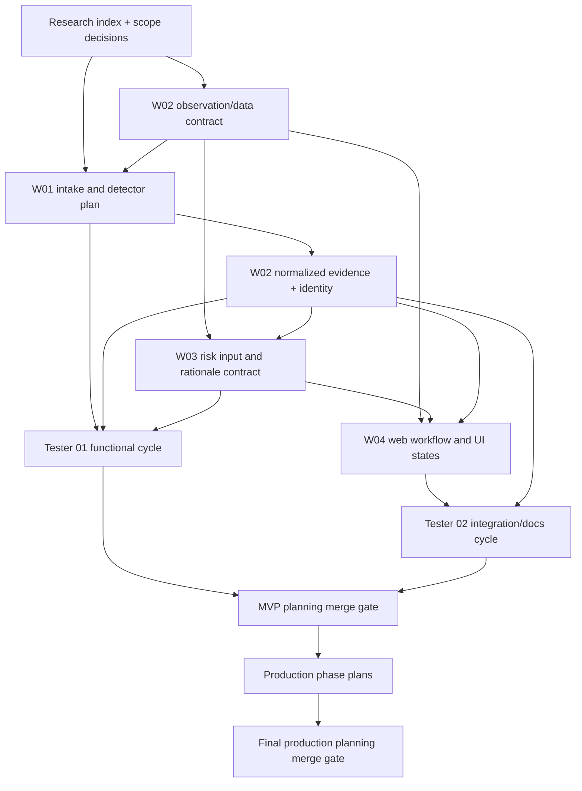

# Dependency graph and merge-safe sequencing

## Coupling controls
- W01 defines supported artifact families and raw observation fields; W02 owns normalized model/identity semantics. Additive changes only after contract review; no independent competing “finding” schemas.
- W03 consumes W02's normalized records; do not duplicate scanner logic in risk. Risk engine returns explanations as data, not UI-specific prose.
- W04 consumes stable job/observation/risk/export contracts and does not invent hidden status states.
- Testers reference acceptance IDs and contract version. Any material contract change triggers targeted retest and report update.
- Phase reports are separate files per owner/phase to avoid write conflicts. Worker handoffs describe pending items and docs to update.

## Critical path
Research scope → W02 schema and W01 surface matrix → W01 detectors + W02 provenance → W03 risk/queue → W04 integrated experience → Tester 01/02 cycles → MVP merge. W01/W02 can parallelize after the logical contract is agreed; W04 can plan navigation before implementation but freezes state labels only after contract lock. Production is strictly after MVP gate.
